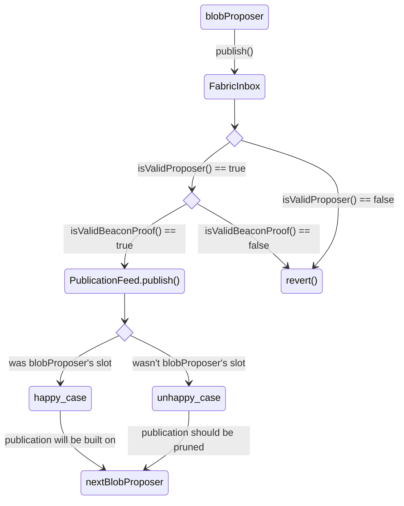

{: .no_toc }

## Table of contents
{: .no_toc .text-delta }

1. TOC
{:toc}

---


{: .important-title }
> Important
>
> This is the latest iteration of research based on recent developments and conversations. For more context readers are encouraged to read original [Dido post](/website/research/Dido).

# TL;DR
- Raid = "Retroactive Attestation of Inbox Data"
- Inbox contracts do filtering at blob publication time:
    1. the `blobProposer` must prove they're an allowed preconfer using the [URC](https://github.com/eth-fabric/urc)
    2. then they either 
        - prove they're building on a valid `unsafeHead`, which promotes the last `unsafeHead` to the `safeHead` and then inserts their publication as the new `unsafeHead`. 
        - prove that the current `unsafeHead` is invalid and replace it with their own (`safeHead` is unmoved). This case only happens if a preconfer proposed during someone else's slot.
- Valid means that the `blobProposer` proposed during their correct L1 slot and this is proved via EIP-4788 validator proofs at least one slot *after* an `unsafeHead` is published (hence the "retroactive" part)
- Rollup nodes only use the historical `safeHeads` to derive the rollup's state


In the ideal scenario where preconfers only submit during their slots, the state transitions pictured above would be a line with a slope of one.

# Context
During [Fabric Call #1](https://youtu.be/UngTQPjy4UA?si=Y8puLV91Bjg1Iko6&t=2214), [Lin Oshitani](https://x.com/linoscope) raised an important issue where the upcoming MaxEB ([EIP-7251](https://eips.ethereum.org/EIPS/eip-7251)) upgrade in Pectra exacerbates an existing problem that makes the beacon chain lookahead window non-deterministic between epochs. This issue motivated [new designs](https://youtu.be/UngTQPjy4UA?si=g_0Zy4fU-eC3kmhh&t=3094) as well as [EIP-7917](https://ethereum-magicians.org/t/eip-7917-deterministic-proposer-lookahead/23259) to make the lookahead deterministic, while also making it easier to prove on-chain. By combining these with lessons from the Dido approach, we can arrive at a vastly simpler design which we call *Raid*, but before that some context.

## Lookahead non-determinism

### Aside - EIP-4788

For those unfamiliar, [EIP-4788](https://eips.ethereum.org/EIPS/eip-4788) exposes the beacon block root to the execution layer. This allows smart contracts to access up to the last 8091 beacon block roots and use them to prove things about the consensus layer (e.g., validator 10 was the proposer and had 31.99 ETH at this slot). 


Pictured above is the `BeaconBlockHeader` schema and the `beacon_block_root` is the Merkle root obtained by hashing the fields of the header as shown. Since the root is accessible on-chain, you can make claims about the state of the beacon chain that can be verified via smart contract.

To prove who the proposer was at a specific slot you can supply a contract with the `slot`, `proposer_index`, `state_root`, and `body_root`. The contract's logic would Merklize everything and compare the result with the `beacon_block_root` fetched via EIP-4788. Note we don't need to supply the `parent_root` as it is simply the `beacon_block_root` from the previous slot and can also be fetched via EIP-4788. To make more complicated claims about the beacon chain's state, you can similarly prove against the `state_root` or `body_root`, and then connect it back to the `beacon_block_root` as just described.

A big limitation of EIP-4788 is that it only reports the `beacon_block_root` of the *last* slot. This means that while a contract is being executed, it has no way of knowing the current `beacon_block_root` and therefore cannot determine who the current proposer is. 

In the context of based sequencing, knowing who the current proposer is allows inboxes to filter for registered preconfers. This limitation of EIP-4788 is what motivated the need to use the beacon lookahead in the first place.

### How is the lookahead calculated?
Unfortunately, the lookahead is not stored in the beacon chain's state. If it was, then EIP-4788 could be used to prove the lookahead to a contract which inboxes could consume. Instead, consensus clients calculate the lookahead from the beacon state. 

The [`get_beacon_proposer_index`](https://github.com/ethereum/consensus-specs/blob/dev/specs/phase0/beacon-chain.md#get_beacon_proposer_index) function determines who the proposer should be at a slot given the beacon chain's state.

```python
def get_beacon_proposer_index(state: BeaconState) -> ValidatorIndex:
    """
    Return the beacon proposer index at the current slot.
    """
    epoch = get_current_epoch(state)
    seed = hash(get_seed(state, epoch, DOMAIN_BEACON_PROPOSER) + uint_to_bytes(state.slot))
    indices = get_active_validator_indices(state, epoch)
    return compute_proposer_index(state, indices, seed)
```

It calls [`compute_proposer_index`](https://github.com/ethereum/consensus-specs/blob/dev/specs/electra/beacon-chain.md#modified-compute_proposer_index) which depends on the validator's effective balance:

```python
def compute_proposer_index(state: BeaconState, indices: Sequence[ValidatorIndex], seed: Bytes32) -> ValidatorIndex:
    """
    Return from ``indices`` a random index sampled by effective balance.
    """
    assert len(indices) > 0
    MAX_RANDOM_VALUE = 2**16 - 1  # [Modified in Electra]
    i = uint64(0)
    total = uint64(len(indices))
    while True:
        candidate_index = indices[compute_shuffled_index(i % total, total, seed)]
        # [Modified in Electra]
        random_bytes = hash(seed + uint_to_bytes(i // 16))
        offset = i % 16 * 2
        random_value = bytes_to_uint64(random_bytes[offset:offset + 2])
        effective_balance = state.validators[candidate_index].effective_balance
        # [Modified in Electra:EIP7251]
        if effective_balance * MAX_RANDOM_VALUE >= MAX_EFFECTIVE_BALANCE_ELECTRA * random_value:
            return candidate_index
        i += 1
```

When  the consensus client calls [`process_block_header`](https://github.com/ethereum/consensus-specs/blob/dev/specs/phase0/beacon-chain.md#block-header) to verify a block, it verifies that the proposer was correct by calling `get_beacon_proposer_index`.


```python
def process_block_header(state: BeaconState, block: BeaconBlock) -> None:
    # Verify that the slots match
    assert block.slot == state.slot
    # Verify that the block is newer than latest block header
    assert block.slot > state.latest_block_header.slot
    # Verify that proposer index is the correct index
    assert block.proposer_index == get_beacon_proposer_index(state)
    # Verify that the parent matches
    assert block.parent_root == hash_tree_root(state.latest_block_header)
    # Cache current block as the new latest block
    state.latest_block_header = BeaconBlockHeader(
        slot=block.slot,
        proposer_index=block.proposer_index,
        parent_root=block.parent_root,
        state_root=Bytes32(),  # Overwritten in the next process_slot call
        body_root=hash_tree_root(block.body),
    )

    # Verify proposer is not slashed
    proposer = state.validators[block.proposer_index]
    assert not proposer.slashed
```

Importantly, while `get_beacon_proposer_index` is a deterministic function `compute_proposer_index` depends on the effective balances of the validators to select the proposer. At the end of each epoch, the [`process_epoch`](https://github.com/ethereum/consensus-specs/blob/dev/specs/electra/beacon-chain.md#epoch-processing) function is called which modifies the effective balances via [`process_effective_balance_updates`](https://github.com/ethereum/consensus-specs/blob/dev/specs/electra/beacon-chain.md#modified-process_effective_balance_updates).

```python
def process_epoch(state: BeaconState) -> None:
    process_justification_and_finalization(state)
    process_inactivity_updates(state)
    process_rewards_and_penalties(state)
    process_registry_updates(state)  # [Modified in Electra:EIP7251]
    process_slashings(state)  # [Modified in Electra:EIP7251]
    process_eth1_data_reset(state)
    process_pending_deposits(state)  # [New in Electra:EIP7251]
    process_pending_consolidations(state)  # [New in Electra:EIP7251]
    process_effective_balance_updates(state)  # [Modified in Electra:EIP7251]
    process_slashings_reset(state)
    process_randao_mixes_reset(state)
    process_historical_summaries_update(state)
    process_participation_flag_updates(state)
    process_sync_committee_updates(state)
```

A consensus client can sample the lookahead by repeatedly calling `get_beacon_proposer_index` with an increasing slot number. Since the effective balances do not change within an epoch, this is sufficient to guarantee a correct calculation of the *current* epoch's lookahead, even if you do not have the actual `BeaconState` for upcoming slots. This is in part because the [`get_seed`](https://github.com/ethereum/annotated-spec/blob/master/phase0/beacon-chain.md#get_seed) function returns a fixed value for the epoch.

```python
def get_seed(state: BeaconState, epoch: Epoch, domain_type: DomainType) -> Bytes32:
    """
    Return the seed at ``epoch``.
    """
    mix = get_randao_mix(state, Epoch(epoch + EPOCHS_PER_HISTORICAL_VECTOR - MIN_SEED_LOOKAHEAD - 1))  # Avoid underflow
    return hash(domain_type + uint_to_bytes(epoch) + mix)
```

### The epoch boundary
While the lookahead is fixed intra-epoch, non-determinism arises when attempting to calculate the lookahead for the next epoch before the epoch boundary. Since `process_epoch` updates the effective balances at the epoch boundary, it is possible that a pre-computed lookahead ends up incorrect if a validator's effective balance changed. 

EIP-7251 introduces more opportunities for effective balances to change, i.e., if validators consolidate, which can increase the probability that the lookahead changes at the epoch boundary.

### Why this matters for preconf protocols
Based rollups use preconfs to improve their UX. L2 users can send transactions directly to preconfers instead of waiting for them to get picked up from the mempool by a proposer (see [here](/website/education/composability/composability-and-based#sequencer-selection) for more context).

Within an epoch it's possible to deterministically calculate the lookahead so we're fine. Based rollups and wallets can use this to select preconfers and direct user transactions to them. However, between epochs, it's *impossible* to definitely know ahead-of-time what the lookahead will look like - there's always some possibility that the lookahead changes because of an effective balance change at the end of an epoch.


Lin [summarizes the problem](https://hackmd.io/@linoscope/eip-7917-from-preconf-protocol) neatly in this image. Once slot 29 elapses, there are no more preconfers left in the epoch. The rollup is faced with a choice:
1. optimistically calculate the next epoch's lookahead and assign preconfers
2. disable preconfs until the next epoch starts

Option 1 is problematic if the lookahead changes, since the issued preconfs can no longer be guaranteed if the *assumed* proposer does not become the *actual* proposer. Option 2 is a bad UX - imagine if the last preconfer were much earlier in the epoch e.g., slot 8. The based rollups degrades back to [*total anarchy mode*](/website/education/composability/composability-and-based#total-anarchy) for 75% of the epoch!

## EIP-7917
Clearly, cross-epoch lookhead non-determinism is an issue for preconf protocols, so what can we do about it? Lin Oshitani and Justin Drake collaborated to define [EIP-7917](https://eips.ethereum.org/EIPS/eip-7917) which allows for the lookahead to be deterministically calculated across epoch-boundaries. 

The EIP requires extremely few changes to the spec (just ~20 lines of code). The solution introduces the lookahead as a field within the beacon state which conveniently addresses our previous problem - with this EIP, a contract can *prove the lookahead using EIP-4788*. Better yet, they can prove the lookahead for the current or next epoch given any beacon block root in the current epoch (it doesn't need to be just-in-time). 

The updated `process_epoch` function now calculates the lookahead for the upcoming *and subsequent* epoch meaning we always know the lookahead for the next epoch and our non-determinism is solved! 

The EIP is currently under review for inclusion in the Fulu upgrade, and if included will add stability to the network and significantly help the viability of preconf protocols.

## How can the lookahead be proven before EIP-7917?
Once EIP-7917 is in production, contracts will be able to easily prove the lookahead using EIP-4788. Until that time, alternative approaches need to be considered for rollup inbox contracts to be aware of who the proposer is.

### Pessimistic lookahead contract
Since the lookahead is *not* part of the `BeaconState`, we need to prove we executed the `get_beacon_proposer_index` function correctly. Since implementing the `get_beacon_proposer_index` logic in a contract is infeasible gas-wise, the alternative approach is to prove the execution via ZKP and supply a contract with the proof. The inbox contract can verify it and accept lookahead, then the contract can filter blobs for the correct proposer at submission time.

**Pros**

- Trustless 
- Straightforward

**Cons**

- Implementing consensus client the logic in a ZK circuit is non-trvial i.e., it's a smaller scope of what Beam chain is doing
- Proving increases latency and increases hardware requirements for proposers
- The cost to verify the proof on-chain will significantly increase the rollup's operating costs

---

### Optimistic lookahead contract 
The [Nethermind / Taiko’s PoC](https://github.com/NethermindEth/Taiko-Preconf-AVS/tree/master/SmartContracts/src/avs) pioneered this approach. Here, the first preconfer in the epoch will post the view of the entire lookahead to the inbox contract. The view is purely optimistic as no complex proving is done. If anyone detects fraud, they can prove the correct proposer after the slot has elapsed via EIP-4788 to slash them. 

**Pros**

- Optimistic is cheaper than proving
- Trustless because of fraud proof mechanism

**Cons**

- Need to incentivise the proposer to post the lookahead
- Need a reconciliation process should there be fraud

---

### L2 derivation
As proposed in [Dido](/website/research/Dido), we can move the logic of calculating the lookahead into the L2 node. During derivation, the L2 node can compute the lookahead by running `get_beacon_proposer_index` and use this to filter for whether a blob should be executed or skipped. 

**Pros**

- No on-chain logic or costs
- Trustless

**Cons**

- Adds complexity to derivation logic
- Requires the L2 node to know the full `BeaconState`

---

### Branching inbox contract
Originally suggested by [Swapnil](https://x.com/swp0x0) from the Nethermind team, the Branching Inbox Contract (BIC) approach stood out for its elegance and simplicity and is what we'll focus on for Raid. 

{: .important-title }
> important
>
> The Branching Inbox Contract approach removes the need for a lookahead!


BIC works similarly to Dido, except with even less assumptions. When a blob is submitted to the an inbox, the submitter omits any kind of proof pertaining to the lookahead and the inbox accepts the blob *without reverting*. Multiple proposers can queue up their blob transactions at this inbox but the canonical state is not immediately resolved, effectively creating branches of different possible L2 states (hence the name branching inbox contracts). Importantly, the inbox contract cannot determine who the proposer was while processing the blob transaction because the current `beacon_block_root` is still unknown at execution time.

From the POV of an L2 node, they can verify who the proposer was using EIP-4788 as soon as the blob transaction is published to the L1, because the EVM will now have access to the `beacon_block_root`. Therefore you can think of BIC as "anyone can post blobs but we'll figure out if they were allowed to later."

It should be noted that it is still possible for L2 nodes to determine who the proposer is ahead-of-time without waiting for the next slot by using the lookahead (i.e., by running a beacon node in parallel), BIC simply removes this logic from the L2's derivation pipeline.

**Pros**

- **Reduces on-chain complexity**: There’s no need for the inbox to have an on-chain view of the lookahead (optimistic / pessimistic lookahead approaches)
- **Reduces L2 derivation complexity**: There’s no need to execute the beacon node lookahead logic within L2 derivation

**Cons**

- **Incompatible with realtime settlement:** It isn’t possible for the rollup to settle in one block to compose with the L1 synchronously as the `beacon_block_root` is unknown at blob-posting time.

Clearly the pros of BIC are extremely compelling to simplify the ideas from Dido but being incompatible with realtime settlement negates the biggest promises of based sequencing which is universal synchronous composability.

# Proposed V2 design
Raid incorporates the ideas of BIC and Dido with a focus on pragmatism to achieve based sequencing today. Despite not being compatible with real-time settlement, we are yet to see real-time proving in production, so aiming for BIC in the short term is a way to significantly reduce based rollup complexity before the tradeoff becomes apparent. Once EIP-7917 is live, inboxes can switch to proving the lookahead on-chain via EIP-4788 to be compatible with real-time settlement. 

## Reference Implementation
Readers are encouraged to checkout this [PoC of Raid](https://github.com/OpenZeppelin/minimal-rollup/pull/104) that builds on OpenZeppelin's minimal-rollup implementation. The following section will describe the design in more depth.  

Raid assumes two L1 contracts, the `FabricInbox` and OpenZeppelin's [`PublicationFeed`](https://github.com/OpenZeppelin/minimal-rollup/blob/main/src/protocol/PublicationFeed.sol). We refer to the entity who publishes blobs via the `FabricInbox.publish()` function as the `blobProposer`. We assume that the `blobProposer` is an EOA that the L1 proposer delegated to because BLS keys cannot sign transactions. Note that this means the `blobProposer` can either be owned by the L1 proposer or a delegate key - Raid makes no assumptions about it.

When a `blobProposer` attempts to `publish()` their blob, they are required to include metadata that proves they are building off of a correct rollup head. The exact contents of the metadata are implementation-specific and come with their own trade-offs. For the purposes of this post we'll deep-dive into the fully-onchain version. `blobProposers` are incentivized to provide valid metadata regardless of the implementation, otherwise either `publish()` will revert, or it will succeed but get pruned away by future publications. 

### Step 1 - verify the `blobProposer` is allowed


    function publish(
            uint256 nBlobs,
            uint64 anchorBlockId,
            RegistrationProof calldata registrationProof,
            ValidatorProof calldata validatorProof,
            bool replaceUnsafeHead
        ) external payable;

- It is permissionless to call `FabricInbox.publish()`, but it contains logic to filter for valid submissions.
- `registrationProof` contains a Merkle proof that proves a specific BLS public key was registered to the URC. The following snippet demonstrates how the URC can be queried to ensure the `blobProposer` satisfied the rollup's preconditions. This allows a `blobProposer` to prove statements like "the proposer with BLS key `0xabcd...` was opted into preconf protocol `0x1234...` with at least 1 Ether collateral and delegated blob submission rights to my EOA with address `0x5678...`."

        modifier isAllowedProposer(
            IRegistry.RegistrationProof calldata registrationProof
        ) {
            // Get the URC's config
            IRegistry.Config memory config = registry.getConfig();

            // Get the data of the operator from the URC
            // This will revert if the proof is invalid
            IRegistry.OperatorData memory operator = registry
                .getVerifiedOperatorData(registrationProof);

            // Perform sanity checks on the operator's data
            require(
                operator.collateralWei >= requiredCollateralWei,
                "Insufficient collateral"
            );

            require(operator.slashedAt == 0, "Operator has been slashed");

            // Verify operator has not unregistered
            if (operator.unregisteredAt != type(uint48).max) {
                require(
                    block.number <
                        operator.unregisteredAt + config.unregistrationDelay,
                    "Operator unregistered"
                );
            }

            // Get information about the operator's commitment to the rollup's specified slasher
            IRegistry.SlasherCommitment memory slasherCommitment = registry
                .getSlasherCommitment(registrationProof.registrationRoot, slasher);

            // Perform sanity checks on the slasher commitment
            require(
                slasherCommitment.optedOutAt < slasherCommitment.optedInAt,
                "Not opted into slasher"
            );

            require(slasherCommitment.slashed == false, "Operator has been slashed");

            require(
                slasherCommitment.committer == msg.sender,
                "Wrong blob submitter address"
            );

            require(
                block.number >
                    slasherCommitment.optedInAt + config.optInDelay,
                "Too early to make commitments"
            );

            // Enter any other pre-condition checks here
            // ... 

            _;
        }


### Step 2 - verify the proposal happened during the correct slot
The `isAllowedProposer` modifier allows the `FabricInbox` to filter for valid `blobPoposers` but there's still an issue - the `blobProposer` can call `publish()` at *any* slot by supplying a valid `registrationProof`. To ensure that `blobProposers` get a write-lock on the rollup to allow for execution preconfs, we need to enforce publications are only successful if published during their L1 proposer's slot.

However, as we covered earlier, without a view of the lookahead or EIP-7917, we cannot know the *current* L1 proposer during the execution of `publish()`. Instead, we require the `blobProposer` to prove that the head they are building off is valid, i.e., the parent `blobProposer` published during their slot and not someone else's.

`validatorProof` is a Merkle proof for beacon chain data that does just this (see [Tony's ethresearch post on how they're generated](https://ethresear.ch/t/slashing-proofoor-on-chain-slashed-validator-proofs/19421)). It proves which validator public key was used during the slot of the parent `blobProposer's` call to `publish()`. By checking this against the validator public key that the parent `blobProposer` committed to, we can retroactively verify that their publication was valid.

    function isValidBeaconProof(uint256 parentBlockNum, ValiatorProof calldata validatorProof) {
        // Fetch the beaconBlockRoot from the parent blobProposer's slot via EIP-4788
        bytes32 beaconBlockRoot = getBeaconBlockRootFromTimestamp(timestamps[parentBlockNum]);

        // Check that the merkle proof is valid for this slot and recover the validator public key for that slot
        BLSG1Point validatorPubkey = verifyValidatorProof(beaconBlockRoot, validatorProof);

        // Check that the key matches what was committed by the parent blobProposer
        require(keccak256(abi.encode(validatorPubkey)) == validatorKeyCommitments[parentBlockNum]);

        _;
    }

### Step 3 - updating the safe head
So far we have the following execution paths:




We see that by successfully executing `isValidProposer()` and `isValidBeaconProof()` we are assured that the `blobProposer` was allowed to publish (i.e., was an opted-in preconfer) and their proposal builds off of a valid parent proposal. However, at the time of execution, the inbox doesn't know if it was the `blobProposer's` slot, which allows us to fall into this *unhappy case*. Their publication will succeed but we need assurances that it won't be used to build the rollup's state.

Imagine $$B_N$$ is published followed by $$B_{N+1}$$ in the subsequent slot. If $$B_{N+1}$$ falls under the *unhappy case* and the next `blobProposer` is trying to submit $$B_{N+2}$$, they are not incentivized to build on $$B_{N+1}$$ and in fact `isValidBeaconProof()` will prevent them from trying. Instead they *should* build on $$B_N$$, but allowing this behavior unchecked can cause unwanted forks, e.g., instead of building on $$B_N$$ the `blobProposer` set their parent far in the past to $$B_{N-i}$$. 

To address this issue we'll start by adopting terminology from the [OP Stack](https://docs.optimism.io/stack/rollup/derivation-pipeline#key-functions-of-the-derivation-pipeline). We'll introduce two variables to the `FabricInbox`: 
- `unsafeHead`: a reference to a publication that is yet to promoted to the safe head or replaced by a different `unsafeHead`
- `safeHead`: a previously `unsafeHead` publication that has been promoted and will be part of the rollup's canonical state

The idea is that `publish()` can do one of two things:
1. replace an `unsafeHead` with a new `unsafeHead`
2. promote the previous `unsafeHead` to the `safeHead` and insert a new `unsafeHead`

The **fork-choice** rule becomes simple: the rollup's state is derived by iterating over all `safeHeads`.


We just need to add logic for a `blobProposer` to replace the current `unsafeHead` if it was submitted during the wrong slot. This requires minimal changes to `isValidBeaconProof()`. 
### Putting it all together


Let's step through this flow:

**Slot N** 
- We assume the rollup starts in it's genesis state
- $$blobProposer_0$$ is a valid preconfer that publishes $$B_0$$ with `replaceUnsafeHead = true`
- $$B_0$$ is published to the `PublicationFeed` contract and returns a $$publicationId_{B_0}$$
- Since `replaceUnsafeHead` is true and there is no previous `unsafeHead`, $$publicationId_{B_0}$$ becomes the new `unsafeHead`
- Rollup nodes don't update their state as there's no new `safeHead`

**Slot N+1** 
- $$blobProposer_1$$ is an invalid preconfer so publishing $$B_1$$ reverts
- $$blobProposer_2$$ is a valid preconfer that publishes $$B_2$$ with `replaceUnsafeHead = false`
- Since `replaceUnsafeHead` is false, $$blobProposer_2$$'s `validatorProof` proves that $$publicationId_{B_0}$$ was indeed submitted during $$blobProposer_0$$'s slot
- Assuming `validatorProof` is valid, $$publicationId_{B_0}$$ is promoted to the `safeHead`, and $$publicationId_{B_2}$$ becomes the new `unsafeHead`
- Rollup nodes receive a `NewSafeHead` event and process $$B_0$$ to update their local L2 state

**Slot N+2** 
- $$blobProposer_3$$ is a valid preconfer that publishes $$B_3$$ with `replaceUnsafeHead = true`
- Since `replaceUnsafeHead` is true, $$blobProposer_3$$'s `validatorProof` proves that it was not $$blobProposer_2$$'s slot when they published $$B_2$$
- Assuming `validatorProof` is valid, $$publicationId_{B_2}$$ is replaced by $$publicationId_{B_3}$$ as the `unsafeHead`
- Rollup nodes don't update their state as there's no new `safeHead`

**Slot N+3** 
- $$blobProposer_4$$ is a valid preconfer that publishes $$B_4$$ with `replaceUnsafeHead = false`
- Since `replaceUnsafeHead` is false, $$blobProposer_4$$'s `validatorProof` proves that $$publicationId_{B_3}$$ was indeed submitted during $$blobProposer_3$$'s slot
- Assuming `validatorProof` is valid, $$publicationId_{B_3}$$ is promoted to the `safeHead`, and $$publicationId_{B_4}$$ becomes the new `unsafeHead`
- Rollup nodes receive a `NewSafeHead` event and process $$B_3$$ to update their local L2 state

### Assumptions
- `publish()` can only successfully execute once per block to ensure that `unsafeHeads` can be pruned.
- Since EIP-4788 only stores the last 8091 beacon block roots, valid blob publications must happen at least daily to ensure consecutive proposals can access the required roots.
- `blobProposers` are incentivized to provide valid `registrationProofs` and `validatorProofs`, or else the contract will revert or the next `blobProposer` will replace their `unsafeHead`.
- `blobProposers` will only build L1 blocks that contain their `publish()` transaction to prevent others from consuming their slot.

### Design choices
- Requiring `blobProposers` to submit the `validatorProof` means that L2 follower nodes are *not* required to run a beacon node. Rather, only the `blobProposer` is which is already assumed for based sequencers. 
- Doing everything on-chain simplifies things but is not the only approach:
    - **hybrid on-chain**: The original Raid design verified `validatorProofs` during L2 derivation but this complicates fork-choice rules as there is no on-chain notion of the `safeHead`.
    - **fully off-chain**: In the spirit of the Dido design, it is possible to verify `registrationProofs` and `validatorProofs` during L2 derivation to reduce on-chain gas costs; however, like the hybrid on-chain approach it complicates the fork-choice rule.

### Remaining considerations
Until we have EIP-7917 there is still the problem of lookahead instability between epoch boundaries due to changes in validators’ expected balances. At the cost of increased complexity, it is possible to enshrine the notion of a fallback “Epoch Bridge Proposer” into the `FabricInbox` [as described by Lin](https://youtu.be/UngTQPjy4UA?si=ODnqHoMS4qjAMh3v&t=2673). The EBP would have authority to write `safeHeads` without it being their slot to ensure consistent preconf uptime between epoch boundaries.

### Summary
The `FabricInbox` serves as a filtration system that ensures the rollup nodes only process valid blobs. By valid we mean:
1. `isValidProposer()` filtered out `blobProposers` that weren't registered to the rollup's specified preconf protocol
2. `isValidBeaconProof()` filtered out blobs that were submitted during the wrong slots
3. `updateHead()` filtered out `unsafeHeads` from `safeHeads`

Picture Adapted from [here](https://prestwich.substack.com/p/the-definitive-guide-to-sequencing) and [here](https://unsplash.com/@nate_dumlao?utm_source=unsplash&utm_medium=referral&utm_content=creditCopyText).

## How does Raid fit into a stack?
A potential end-to-end based rollup flow utilizing Raid:
